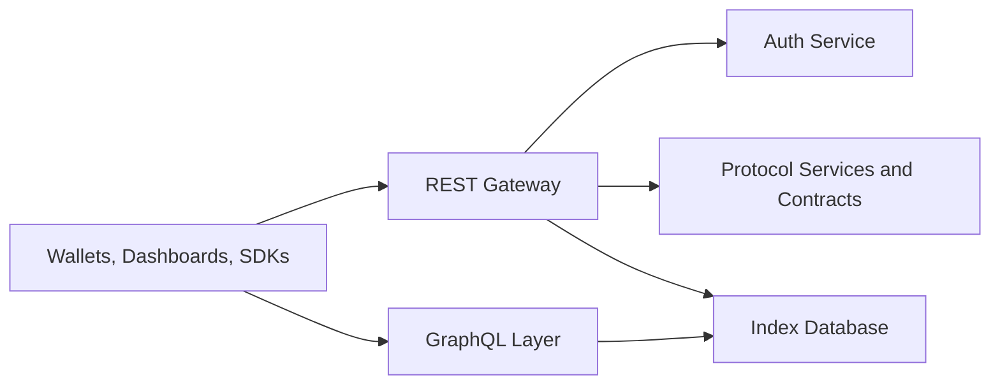

# API Architecture Diagram

```mermaid
flowchart LR
    Clients[Wallets, Dashboards, SDKs]
    Rest[REST Gateway]
    GraphQL[GraphQL Layer]
    Auth[Auth Service]
    Indexer[Index Database]
    Contracts[Protocol Services and Contracts]

    Clients --> Rest
    Clients --> GraphQL
    Rest --> Auth
    Rest --> Contracts
    GraphQL --> Indexer
    Rest --> Indexer
```
