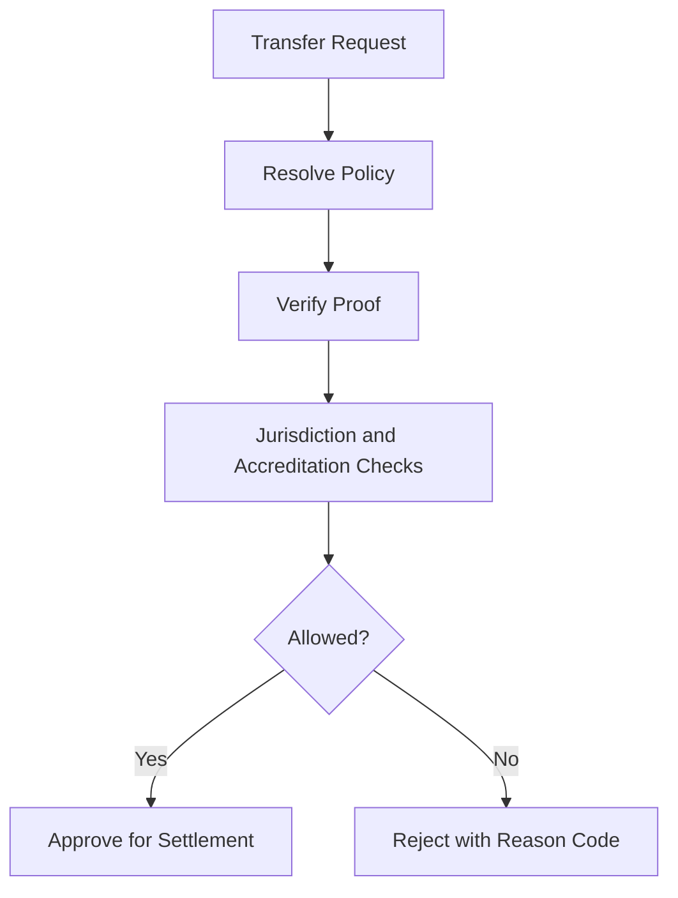

# Compliance Execution Flow Diagram

```mermaid
flowchart TD
    Request[Transfer Request]
    Policy[Resolve Policy]
    Proof[Verify Proof]
    Checks[Jurisdiction and Accreditation Checks]
    Decision{Allowed?}
    Approve[Approve for Settlement]
    Reject[Reject with Reason Code]

    Request --> Policy --> Proof --> Checks --> Decision
    Decision -- Yes --> Approve
    Decision -- No --> Reject
```
