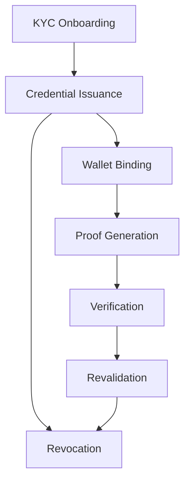

# Identity Lifecycle Diagram

```mermaid
flowchart TD
    Onboard[KYC Onboarding]
    Issue[Credential Issuance]
    Bind[Wallet Binding]
    Proof[Proof Generation]
    Verify[Verification]
    Revalidate[Revalidation]
    Revoke[Revocation]

    Onboard --> Issue --> Bind --> Proof --> Verify --> Revalidate
    Issue --> Revoke
    Revalidate --> Revoke
```
