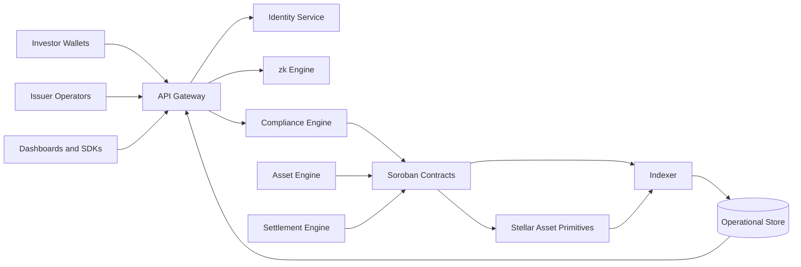

# System Architecture Diagram

```mermaid
flowchart LR
    Wallets[Investor Wallets]
    Issuers[Issuer Operators]
    Clients[Dashboards and SDKs]
    APIGateway[API Gateway]
    Identity[Identity Service]
    ZK[zk Engine]
    Compliance[Compliance Engine]
    Asset[Asset Engine]
    Settlement[Settlement Engine]
    Soroban[Soroban Contracts]
    Stellar[Stellar Asset Primitives]
    Indexer[Indexer]
    Database[(Operational Store)]

    Wallets --> APIGateway
    Issuers --> APIGateway
    Clients --> APIGateway
    APIGateway --> Identity
    APIGateway --> ZK
    APIGateway --> Compliance
    Compliance --> Soroban
    Asset --> Soroban
    Settlement --> Soroban
    Soroban --> Stellar
    Soroban --> Indexer
    Stellar --> Indexer
    Indexer --> Database
    Database --> APIGateway
```
