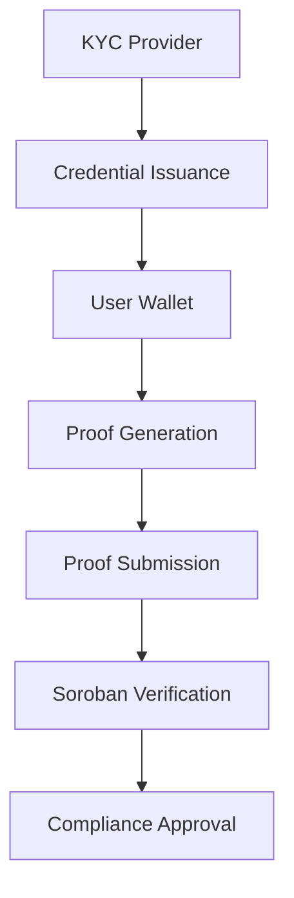

# zk Proof Flow Diagram

```mermaid
flowchart TD
    Provider[KYC Provider]
    Credential[Credential Issuance]
    Wallet[User Wallet]
    Proof[Proof Generation]
    Submit[Proof Submission]
    Verify[Soroban Verification]
    Approval[Compliance Approval]

    Provider --> Credential --> Wallet --> Proof --> Submit --> Verify --> Approval
```
